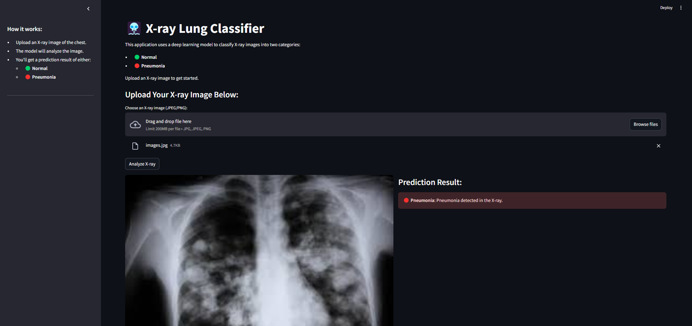

#### Pneumonia Detection in X-ray Images
This project implements a deep learning model to detect pneumonia in chest X-rays. The solution is designed with modular programming principles, leverages AWS S3 for data storage, Docker for containerization, GitHub Actions for CI/CD, and deployment on AWS EC2 for scalability.
#### Features
- **Accurate Classification:** Detects pneumonia from chest X-ray images with a pretrained PyTorch model.
- **Modular Architecture:** Clean separation of preprocessing, prediction, and AWS S3 interaction modules.
- **Cloud Data Storage:** Images, results, and models are stored securely in AWS S3.
- **Dockerized Deployment:** Ensures reproducibility and smooth containerized deployment.
- **Automated CI/CD:** GitHub Actions pipeline for testing, building, and deploying the application.
- **Scalable Deployment:** Runs efficiently on AWS EC2 for global accessibility.

#### Project Workflow
- **User Uploads:** X-ray images are uploaded through a Streamlit app.
- **Preprocessing:** Images are resized and converted to tensors for model inference.
- **Prediction:** A pretrained PyTorch model identifies whether the X-ray is normal or shows pneumonia.
- **Storage:** Uploaded images and results are stored in AWS S3.
- **Deployment:** Dockerized app is deployed on AWS EC2 via CI/CD pipeline.

##### Installation
###### Prerequisites
- Python >= 3.8
- Docker and Docker Compose
- AWS CLI configured with your credentials
- An S3 bucket and EC2 instance set up on AWS

##### Step 1: Clone the Repository
            git clone https://github.com/shubham3032002/PNEUMONIA-detection--Xray-classification.git

#####  Step 2: Install Dependencies       
                  pip install -r requirements.txt

##### Step 3: Set AWS Configuration in Git action   :
               AWS_ACCESS_KEY_ID=your-access-key
               AWS_SECRET_ACCESS_KEY=your-secret-key
               AWS_REGION = 
               DOCKER_USERNAME =
               DOCKER_PASSWORD =
               IMAGE_NAME =
               RESITORY
###### Step 4: Run the App Locally
                streamlit run app/streamlit_app.py

               

              
##### UI

      
##### License
This project is licensed under the MIT License. See LICENSE for more details.

